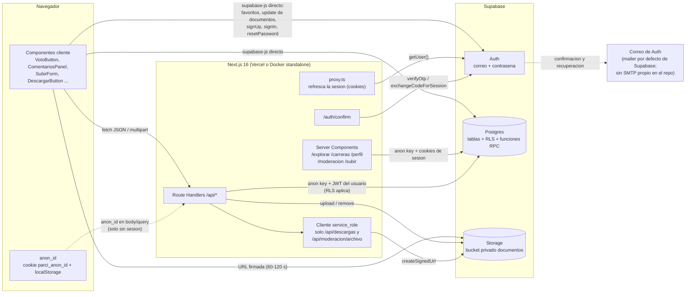
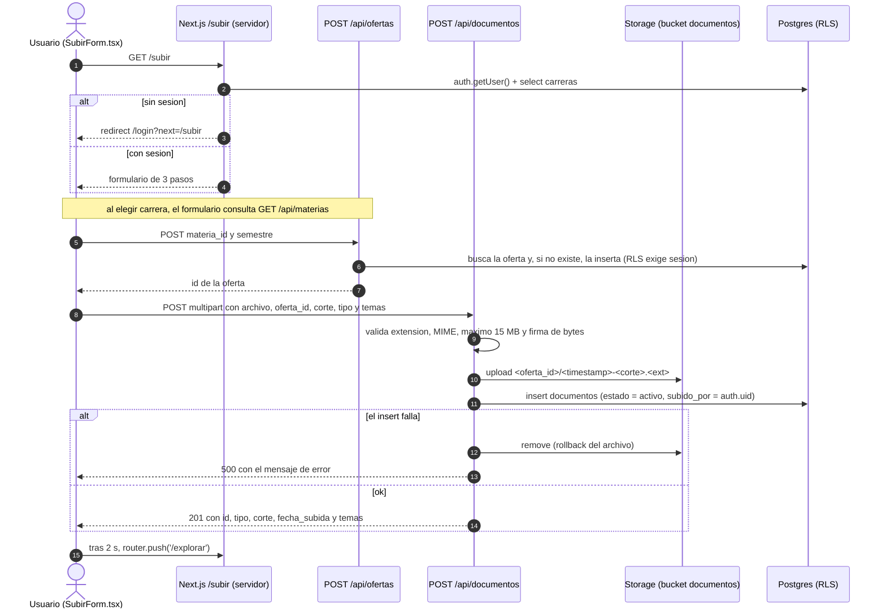
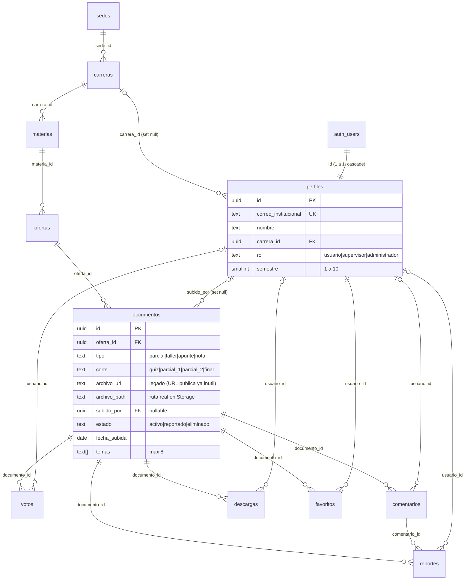

# Arquitectura de Parci

Documento técnico de cómo está construido Parci **hoy**, derivado del código del repositorio (commit `5731493`, 2026-10-03).

## 0. Alcance y método (léelo primero)

| Qué se hizo | Qué NO se hizo |
|---|---|
| Lectura de todos los route handlers, páginas, componentes de interacción, `lib/`, configuración y las 30 migraciones. | **No se accedió al proyecto real de Supabase.** No hay credenciales ni conexión desde este entorno. |
| `tsc --noEmit` (sin errores), `eslint` (0 errores, 1 advertencia) y `vitest run` (36/36). | No se ejecutó la app ni los endpoints contra una base real. |
| Las migraciones se ejecutaron contra **PostgreSQL 16 local** con stubs mínimos de `auth.users`, `auth.uid()`, `storage.buckets/objects` y roles (`anon`, `authenticated`, `service_role`, `supabase_auth_admin`). De ahí salen las tablas, políticas y funciones de la sección 5. | No se probó Auth, Storage ni Auth Hooks reales, ni el envío de correos. |

**Consecuencia clave:** la sección 5 describe el esquema *que producen las migraciones del repo*, no necesariamente el que existe ahora mismo en tu proyecto de Supabase. Hay indicios de que los dos difieren (ver [§7](#7-hallazgos-inconsistencias-y-puntos-no-verificados), H2 y H4). La sección [5.7](#57-cómo-verificar-contra-el-proyecto-real-de-supabase) trae las consultas para comparar en 5 minutos.

---

## 1. Visión general

Parci es una aplicación **Next.js 16 (App Router)** que usa **Supabase como único backend** (Postgres, Auth y Storage). No hay servidor propio de aplicación más allá de las rutas de Next.js, que son delgadas: validan entrada y delegan en Supabase. La **autorización real vive en la base de datos** (políticas RLS y funciones SQL `security definer`).

- UI: React 19 + Tailwind CSS v4 (tokens en CSS con `@theme inline`, sin `tailwind.config`).
- Lectura pública: cualquier visitante puede explorar, votar, comentar y reportar; subir requiere cuenta `@correounivalle.edu.co`.
- Despliegue: Vercel (`main` → producción). Alternativa: imagen Docker `standalone`.

## 2. Diagrama de arquitectura




## 3. Decisiones técnicas importantes

Cada decisión indica **dónde está justificada**. Cuando no hay una justificación escrita, se dice.

### 3.1 Next.js 16 con App Router
Server Components reducen el JavaScript enviado al cliente (importante en móvil con datos limitados) y permiten consultar Supabase en el servidor. *Fuente: ADR-001.* Detalle de esta versión: `middleware.ts` pasó a llamarse **`proxy.ts`**; aquí refresca el JWT de Supabase en cada navegación.

### 3.2 Supabase en vez de un backend propio
Une en un solo servicio: autenticación con restricción por dominio de correo, RLS por fila, Storage para los archivos y Postgres real; evita semanas de infraestructura que no aportan al MVP. *Fuente: ADR-002.* Consecuencias visibles en el código: las rutas `/api` son finas; la lógica sensible (conteo de reportes, límites de descarga, moderación de comentarios) está en funciones SQL; varios componentes del navegador hablan directo con Supabase.

### 3.3 Lectura pública y votos/comentarios/reportes sin cuenta
- *Documentado:* ADR-004 — un visitante que llega desde un enlace de WhatsApp no debe toparse con un login; el registro se pide solo al subir contenido. ADR-003 (mobile-first) explica que el canal principal es WhatsApp/Telegram.
- *Lo que **no** hay escrito:* un ADR específico que justifique permitir **votar, comentar y reportar** sin cuenta. La migración `011_votos_comentarios.sql` explica el mecanismo: un `anon_id` (UUID generado en el navegador, guardado en cookie y `localStorage`) identifica al visitante, **"no es un mecanismo de seguridad"** y solo evita el doble voto o spam básico desde el mismo navegador. La cookie (en vez de, por ejemplo, la IP) permite además que el Server Component de `/explorar` lea el valor en el primer render y pinte el botón "ya votaste" sin parpadeo.
- *Costo asumido:* el servidor confía en el `anon_id` que manda el cliente. Quien genere UUID nuevos puede votar varias veces, saltarse el límite de 2 descargas y, con 3 reportes, ocultar un documento (la migración `020` lo reconoce: cierra el abuso trivial, no es antifraude).

### 3.4 Correo institucional como filtro de registro
Es el filtro anti-spam más simple sin construir un sistema de moderación grande. *Fuente: ADR-005.* En la práctica se aplica en **tres sitios**, de los cuales solo uno es fuerte y de activación manual:
1. `registro/page.tsx` y `recuperar/page.tsx` (cliente, eludible).
2. El hook SQL `hook_verificar_dominio_institucional` (migración `023`), que rechaza otros dominios con un 400 **si se activa a mano** en el Dashboard (el repo no lo activa y no documenta su estado).
3. El dominio por defecto de `NEXT_PUBLIC_DOMINIO_CORREO`. El SQL del hook tiene el dominio escrito a mano; no lee esa variable.

### 3.5 Lógica en funciones SQL (RPC) en vez de en las rutas
`buscar_documentos` evita repetir joins de 4 tablas (ADR-010). Otras funciones existen por razones técnicas escritas en las migraciones: `registrar_reporte` porque el conteo desde el cliente corría bajo RLS y devolvía siempre 0 (migración `009`); `obtener_comentarios` porque RLS de `perfiles` solo deja ver el perfil propio y hay que resolver el nombre del autor dentro de una función `security definer` (`011`); `is_admin()`/`is_moderador()` para evitar la recursión infinita de políticas sobre `perfiles` (`004`).

### 3.6 Bucket privado y URLs firmadas de corta vida
Antes el bucket era público y la URL del archivo viajaba en el JSON del buscador: cualquiera podía descargar sin pasar por el límite de "2 descargas gratis", que era solo cosmético. Desde la migración `021` el bucket es privado, la búsqueda ya no devuelve ninguna URL y `/api/descargas` emite una URL firmada de **60 s** (120 s para moderadores) **solo si** `registrar_descarga()` lo permite. La firma usa la `service_role` (por eso el cliente admin existe y es solo servidor). *Fuente: comentarios de la migración `021` y de `src/app/api/descargas/route.ts`.*

### 3.7 Límite de descargas: 2 gratis y luego "sube uno"
Cualquier visitante descarga hasta 2 documentos distintos; para más hay que haber subido al menos uno (incentivo a contribuir). *Fuente: migración `018`.* Un anónimo no puede desbloquearlo (subir exige sesión en la UI).

### 3.8 Eliminar el profesor de toda la app
Riesgo por derechos sobre el nombre de los docentes al asociarlos públicamente con material de terceros; se prioriza reducir ese riesgo sobre la búsqueda por profesor. La oferta pasa de materia × profesor × semestre a materia × semestre. *Fuente: ADR-011, migración `016`.*

### 3.9 Moderación de comentarios en la base de datos
Una tabla de palabras prohibidas editable (`palabras_prohibidas_comentarios`) y la función `comentar_documento` que rechaza con `COMENTARIO_PROHIBIDO` / `COMENTARIO_SPAM` (≥ 2 enlaces). Así las reglas cambian sin redeploy (panel en `/moderacion`). *Fuente: migraciones `026`–`028`.* Complementa el flujo humano (3 reportes ⇒ `estado = 'reportado'` ⇒ cola de moderación).

### 3.10 Moderación liviana desde el inicio
Tabla `reportes` y columna `estado` en `documentos` desde el MVP, para poder retirar contenido rápido. *Fuente: ADR-008.*

### 3.11 Tailwind v4 y modo de build
Tokens de diseño en CSS (`@theme inline`) porque Next 16 trae Tailwind v4, que eliminó el archivo de configuración JS (*ADR-009*). `next.config.ts` activa `output: "standalone"` cuando no corre en Vercel (variable `VERCEL`), para la imagen Docker.

---

## 4. Flujo de datos: de la subida de un documento a que otros lo vean



**Paso a paso (con archivos):**

1. **`/subir`** (`src/app/(main)/subir/page.tsx`): Server Component. Sin sesión → `redirect('/login?next=/subir')`. Carga carreras y pinta `SubirForm`.
2. **`SubirForm.tsx`** (cliente, 3 pasos): carrera + materia (las materias vienen de `GET /api/materias`) → semestre + corte + temas opcionales (autocompletado con `GET /api/documentos/temas`) → archivo (arrastrar o elegir; validación previa solo de tamaño).
3. **`POST /api/ofertas`**: busca la oferta `(materia_id, semestre)`; si no existe, la crea.
4. **`POST /api/documentos`**: valida (lista de extensiones y MIME, no vacío, ≤ 15 MB, firma de bytes), sube a Storage con ruta `<oferta_id>/<Date.now()>-<corte><ext>`, inserta la fila en `documentos` y, si falla el insert, borra el archivo.
5. **Visible de inmediato:** la fila nace con `estado = 'activo'`; **no hay cola de aprobación previa**. `buscar_documentos()` devuelve solo `activo`, y la política RLS de lectura pública también.
6. **Cómo lo ven los demás:** `/explorar` es un Server Component dinámico (lee cookies y `searchParams`), así que cada visita llama `buscar_documentos` por RPC; la subida aparece en "Recién subidos" y en su carrera. No hay caché que invalidar.
7. **Cómo lo abren:** `DescargarButton` → `POST /api/descargas` → `registrar_descarga()` → URL firmada de 60 s → modal.
8. **Ciclo de vida posterior:** 3 reportes ⇒ `reportado` (sale de las búsquedas y entra a `/moderacion`); el dueño puede pasarlo a `eliminado` (borrado lógico; el archivo **sigue** en Storage).

Notas: la subida anónima existe en la API pero no en la interfaz, y como `POST /api/ofertas` exige sesión (por RLS), solo serviría si la oferta ya existe. Tras el login, la redirección va a `/`, **no** de vuelta a `/subir` (ver H12).

---

## 5. Estructura de la base de datos

> Reconstruida ejecutando las migraciones (orden verificado: `001`–`012`, `016`–`029` sin `026_moderacion_comentarios.sql`, luego `seed.sql`). **Compárala con tu proyecto real** con las consultas de [§5.7](#57-cómo-verificar-contra-el-proyecto-real-de-supabase).

### 5.1 Relaciones



### 5.2 Tablas (esquema `public`, todas con RLS habilitado)

| Tabla | Columnas | Restricciones y notas |
|---|---|---|
| `sedes` | `id`, `nombre`, `ciudad`, `direccion` | Solo existe la sede de Tuluá (viene del `seed.sql`). Se conserva por si hay más sedes. |
| `carreras` | `id`, `nombre`, `sede_id`→sedes, `color` | `color` ∈ `aula, musgo, ocre, ciruela`. |
| `materias` | `id`, `nombre`, `carrera_id`→carreras | Cascade al borrar la carrera. |
| `ofertas` | `id`, `materia_id`→materias, `semestre` (texto, ej. `2026-1`) | `unique (materia_id, semestre)`. Formato del semestre sin `check`. |
| `perfiles` | `id`→auth.users, `correo_institucional` (unique), `nombre`, `carrera_id`, `rol`, `created_at`, `semestre` | `rol` ∈ `usuario, supervisor, administrador` (default `usuario`); `semestre` 1–10. |
| `documentos` | ver diagrama de §5.1 | `estado` default `activo`; `temas` máx. 8 elementos; `archivo_url` legado, `archivo_path` NOT NULL. |
| `votos` | `id`, `documento_id`, `usuario_id`, `anon_id`, `created_at` | `check`: exactamente uno de `usuario_id`/`anon_id`. Únicos parciales por (documento, usuario) y (documento, anon). |
| `comentarios` | `id`, `documento_id`, `usuario_id`, `anon_id`, `contenido` (1–500), `created_at`, `updated_at`, `estado` | `estado` ∈ `activo, reportado, eliminado`. Un comentario por autor por documento (únicos parciales). |
| `reportes` | `id`, `documento_id`, `comentario_id`, `usuario_id`, `anon_id`, `motivo`, `fecha` | `check`: exactamente uno de documento/comentario; exactamente uno de usuario/anon. Únicos parciales por autor y objetivo. |
| `descargas` | `id`, `documento_id`, `usuario_id`, `anon_id`, `created_at` | Una fila por autor y documento. **Sin políticas**: solo se toca vía `registrar_descarga()`. |
| `favoritos` | PK (`usuario_id`, `documento_id`), `created_at` | Solo usuarios con sesión. |
| `palabras_prohibidas_comentarios` | `palabra` (PK), `activa` | **Sin políticas**: acceso solo vía funciones `security definer`. La migración `027` siembra 7 palabras. |

Eliminadas por migraciones: `profesores` (`016`) e `info_sede` (`012`).

### 5.3 Políticas RLS

| Tabla | Política (operación) | Condición |
|---|---|---|
| `sedes`, `carreras`, `materias` | lectura pública (SELECT) | `true` |
| | solo admin modifica (ALL) | `is_admin()` |
| `perfiles` | ver el propio (SELECT) | `id = auth.uid()` o `is_admin()` |
| | insertar el propio (INSERT) | `id = auth.uid()` |
| | actualizar el propio (UPDATE) | `id = auth.uid()` |
| | admin actualiza cualquiera (UPDATE) | `is_admin()` |
| `ofertas` | lectura pública (SELECT) | `true` |
| | usuario autenticado puede crear (INSERT) | `auth.uid() is not null` |
| `documentos` | lectura pública de activos (SELECT) | `estado = 'activo'` |
| | moderadores ven todos (SELECT) | `is_moderador()` |
| | usuario autenticado puede subir (INSERT) | `auth.uid() is not null and subido_por = auth.uid()` |
| | subida anónima permitida (INSERT) | `auth.uid() is null and subido_por is null` |
| | dueño puede eliminar el suyo (UPDATE) | `subido_por = auth.uid()` (sin restringir columnas) |
| | moderadores actualizan estado (UPDATE) | `is_moderador()` |
| `reportes` | usuario autenticado crea (INSERT) | `auth.uid() is not null and usuario_id = auth.uid()` |
| | reporte anónimo (INSERT) | `auth.uid() is null and usuario_id is null and anon_id is not null` |
| | moderadores ven / eliminan (SELECT, DELETE) | `is_moderador()` |
| `votos` | lectura pública (SELECT) | `true` |
| | usuario autenticado / anónimo vota (INSERT) | uno u otro identificador, nunca ambos |
| `comentarios` | lectura pública (SELECT) | `true` ⚠ (ver H5) |
| | autenticado / anónimo escribe el suyo (INSERT) | idem votos |
| | usuario autenticado edita el suyo (UPDATE) | `usuario_id = auth.uid()` |
| `favoritos` | select / insert / delete propios | `auth.uid() = usuario_id` |
| `descargas`, `palabras_prohibidas_comentarios` | — | RLS activo y **ninguna política**: nadie con rol de cliente accede directo |
| `storage.objects` | subida autenticada (INSERT) | `bucket_id = 'documentos' and auth.uid() is not null` |
| | subida anónima (INSERT) | `bucket_id = 'documentos'` ⚠ (ver H6) |
| | solo admin elimina (DELETE) | `bucket_id = 'documentos' and is_admin()` |

(La política de lectura pública de Storage se creó en `005` y se eliminó en `021`.)

### 5.4 Funciones, triggers y hook

| Función | Tipo | Para qué | La usa |
|---|---|---|---|
| `buscar_documentos(q, carrera, materia, semestre, corte, orden, anon_id, limit, offset)` | invoker | Búsqueda con conteos de votos/comentarios y `ya_voto`. Orden `recientes` o `utiles`. **No devuelve URL de archivo.** | `/explorar`, `GET /api/documentos` |
| `contar_documentos(...)` | invoker | Total con los mismos filtros. | `/explorar` (portada) |
| `sugerencias_temas(materia_id)` | invoker | Temas ya usados en la materia. | `GET /api/documentos/temas` |
| `votar_documento` | definer | Inserta voto y devuelve el conteo. | `POST /api/votos` |
| `comentar_documento` | definer | Upsert del comentario propio + moderación automática. | `POST /api/comentarios` |
| `obtener_comentarios` | definer | Lista comentarios `activo` con el nombre del autor. | `GET /api/comentarios` |
| `eliminar_comentario` | definer | Borra el comentario propio (grant a `anon`, `authenticated`). | `DELETE /api/comentarios` |
| `registrar_reporte` | definer | Inserta, cuenta y marca `reportado` con ≥ 3 (documentos y comentarios). | `POST /api/reportes` |
| `registrar_descarga` | definer | Aplica el límite y registra la descarga. | `POST /api/descargas` |
| `comentario_contiene_palabra_prohibida` | definer | Compara contra la tabla de palabras. | interna |
| `listar/agregar/cambiar_estado/eliminar_palabra_prohibida` | definer | CRUD de palabras (verifican `is_moderador()`). | `/api/moderacion/palabras` |
| `is_admin()`, `is_moderador()` | definer | Helpers para políticas y rutas. | RLS y `/api/moderacion/*` |
| `handle_new_user()` | trigger definer | `after insert on auth.users`: crea la fila de `perfiles` (nombre desde metadatos o parte local del correo; `carrera_id` y `semestre` si son válidos). | Auth |
| `evitar_autoascenso_rol()` | trigger definer | `before update on perfiles`: si alguien con sesión (no admin) intenta cambiar su `rol`, lo revierte en silencio. | RLS |
| `hook_verificar_dominio_institucional(event jsonb)` | hook | Rechaza correos fuera de `correounivalle.edu.co`. **Hay que activarlo en el Dashboard.** | Auth (si se activa) |
| ⚠ `resolver_comentario_moderacion` | — | **No está definida en ninguna migración**, pero la llama `PATCH /api/moderacion/comentarios`. | (ver H4) |

### 5.5 Storage

- Bucket `documentos`. Se crea **público** en `005` y pasa a **privado** en `021`. Las migraciones no fijan `file_size_limit` ni `allowed_mime_types`: las validaciones de tipo y tamaño existen solo en `POST /api/documentos`.
- Ruta de objeto: `<oferta_id>/<timestamp>-<corte>.<ext>`; el backfill de `021` asume ese formato para `archivo_path`.
- Lectura: solo mediante URL firmada creada con `service_role`.

### 5.6 Datos de arranque (`seed.sql`)

1 sede, 10 carreras, 91 materias (pénsum de Ingeniería de Sistemas y Tecnología en Desarrollo de Software, más otras carreras con pocas materias) y 5 ofertas de ejemplo; **0 documentos**. Los IDs son fijos (`10000000-…`, `20000000-…`).

### 5.7 Cómo verificar contra el proyecto real de Supabase

Ejecuta esto en el SQL Editor del proyecto y compara con las secciones 5.2–5.5:

```sql
-- 1) Tablas, columnas y nulabilidad
select table_name, column_name, data_type, is_nullable
from information_schema.columns where table_schema = 'public' order by 1, ordinal_position;

-- 2) RLS por tabla
select c.relname, c.relrowsecurity
from pg_class c join pg_namespace n on n.oid = c.relnamespace
where n.nspname = 'public' and c.relkind = 'r' order by 1;

-- 3) Políticas (incluye storage). Ojo con comentarios, votos y storage.objects
select schemaname, tablename, policyname, cmd, qual, with_check
from pg_policies where schemaname in ('public', 'storage') order by 1, 2, 3;

-- 4) Funciones: ¿existe resolver_comentario_moderacion? ¿cuántas versiones de buscar_documentos hay?
select p.proname, pg_get_function_identity_arguments(p.oid) as args, p.prosecdef as definer
from pg_proc p join pg_namespace n on n.oid = p.pronamespace
where n.nspname = 'public' order by 1, 2;

-- 5) Definición real de la función faltante (si existe)
select pg_get_functiondef(p.oid)
from pg_proc p join pg_namespace n on n.oid = p.pronamespace
where n.nspname = 'public' and p.proname = 'resolver_comentario_moderacion';

-- 6) Bucket
select id, public, file_size_limit, allowed_mime_types from storage.buckets;

-- 7) Triggers sobre auth.users y perfiles
select event_object_schema, event_object_table, trigger_name
from information_schema.triggers where event_object_table in ('users', 'perfiles');
```

Y en el Dashboard: Authentication → **Hooks** (¿está activo el hook de dominio?), **SMTP Settings**, **URL Configuration** y **Email Templates**.

---

## 6. Lo planeado frente a lo que existe

> **`documentacion_fase1.md` no está en el repositorio** (ni en la rama que se revisó, ni en ningún otro archivo; la búsqueda por nombre no devolvió nada). Si vive fuera del repo o en otra rama, pásalo y la comparación se repite contra él. Mientras tanto, lo más cercano a un "plan original" que sí está versionado es: el esquema inicial (`001`–`003`), `docs/ADRs.md` y `docs/DOCUMENTACION.md`. Comparado contra eso:

### 6.1 Esquema inicial (`001`) frente al esquema actual

| Planeado en el esquema inicial | Hoy | Migración / ADR |
|---|---|---|
| Tabla `profesores`; `ofertas` = materia × **profesor** × semestre; búsqueda por profesor | **Eliminado.** Oferta = materia × semestre | `016`, ADR-011 (reemplaza ADR-006/007) |
| Tabla `info_sede` (biblioteca, bienestar, admisiones, contacto, mapa) | **Eliminada** (fuera de alcance del MVP) | `012` |
| Roles `estudiante` / `egresado` / `admin` | `usuario` / `supervisor` / `administrador` | `006` |
| `documentos.archivo_url` apuntando a un bucket público | Bucket **privado**; ruta en `archivo_path`; descarga por URL firmada. `archivo_url` queda como dato legado | `021` |
| `reportes.usuario_id` obligatorio, solo sobre documentos | Reportes anónimos (`anon_id`), sobre documentos **o** comentarios; auto-flag con 3 | `009`, `010`, `011`, `020`, `025` |
| `buscar_documentos` con filtro y texto por profesor, sin votos | Sin profesor; con votos, comentarios, `ya_voto`, `orden`, temas | `011`, `016`–`021` |
| — (no existía) | Tablas nuevas: `votos`, `comentarios`, `descargas`, `favoritos`, `palabras_prohibidas_comentarios` | `011`, `018`, `025`, `027` |
| — | `documentos.temas` (texto → `text[]`), `perfiles.semestre`, `comentarios.estado`, `reportes.anon_id`, `documentos.archivo_path` | `017`/`019`, `029`, `025`, `020`, `021` |
| — | Hook de dominio institucional, límite de 2 descargas, moderación automática de comentarios | `023`, `018`, `026`–`028` |

### 6.2 `docs/DOCUMENTACION.md` y `docs/ADRs.md` frente al código

Estos documentos quedaron atrás; lo que ya no es cierto:

| Dice | Realidad |
|---|---|
| Migraciones `001..016` | Hay `001`–`030` (con numeración repetida en `022`, `025` y `026`). |
| Archivos en "bucket público `documentos`" | Privado desde `021`; descarga por URL firmada (`/api/descargas`). |
| `SUPABASE_SERVICE_ROLE_KEY`: "no se usa en rutas de la app" | **Sí se usa**: `/api/descargas` y `/api/moderacion/archivo` (vía `lib/supabase/admin.ts`). |
| `NEXT_PUBLIC_APP_URL`: "URL base de la app" | **Ningún archivo la lee.** |
| Rutas API: carreras, materias, ofertas, documentos, votos, comentarios, reportes | Faltan en la lista: `documentos/temas`, `descargas`, `moderacion/archivo`, `moderacion/comentarios`, `moderacion/palabras`; `comentarios` ya tiene también `DELETE`. |
| `/auth/confirm` recibe `token_hash`+`type` ("no `code`") | Acepta **ambos**: `code` (PKCE) y `token_hash`+`type`. |
| Moderación: "lista documentos `reportado` y `activo`" | La consulta del código trae solo `estado = 'reportado'`. Además hay moderación de comentarios y panel de palabras prohibidas. |
| Funciones RPC listadas | Faltan `registrar_descarga`, `eliminar_comentario`, `contar_documentos`, `sugerencias_temas`, las de palabras prohibidas y el hook. |
| Modelo de datos sin `descargas`, `favoritos`, `palabras_prohibidas_comentarios`, `perfiles.semestre` | Existen. |
| Estructura de `src/` sin `carreras`, `perfil`, `recuperar`, `restablecer`, `privacidad`, `components/moderacion`, `lib/supabase/admin.ts`, `lib/actions/perfil.ts` | Existen. |
| Server actions `login`, `logout` | `login` existe pero **no se usa**. |
| ADR-008: "nombres de profesores reales"; ADR-010: join con `profesores` | Obsoletos tras ADR-011 (el ADR-011 no actualiza el texto de ADR-008 ni ADR-010). |
| (sin ADR) | No hay ADR para: votos/comentarios anónimos con `anon_id`, bucket privado + URLs firmadas, límite de descargas, favoritos, moderación automática de comentarios. |

---

## 7. Hallazgos, inconsistencias y puntos no verificados

Ordenados por impacto. **Bloqueante** = impide reproducir el sistema; **Seguridad** = riesgo potencial según las migraciones; **Funcional** = comportamiento distinto del esperado; **Menor** = limpieza.

### Esquema y migraciones

- **H1 · Bloqueante — la migración `030` falla.** Recrea `buscar_documentos()` con `join public.profesores` y el parámetro `p_profesor_id`, pero `016` ya eliminó esa tabla. Al ejecutarla se obtiene `relation "public.profesores" does not exist` (reproducido). Además, por llevar 10 parámetros crearía una *sobrecarga* distinta de la de 9 parámetros que usa la app. **No debe aplicarse tal cual**; si el objetivo era hacer la función `security definer`, hay que reescribirla sin profesores.
- **H2 · Importante (no verificado) — el repo no reproduce lo que hay en Supabase.** El comentario de `030` afirma que `votos` y `comentarios` "ya no permiten SELECT directo desde el cliente", pero ninguna migración quita esas políticas (en el repo siguen con `using (true)`). Junto con H1 y H4, sugiere cambios hechos a mano en el Dashboard que no están versionados. Haz el diff con las consultas de §5.7 y vuelca lo que difiera a migraciones nuevas.
- **H3 · Importante — instalación desde cero no funciona "en orden".** `013`–`015` son migraciones de datos que fallan en una base nueva (la sede solo la crea `seed.sql`); `026_moderacion_comentarios.sql` repite una columna que `025_moderacion_comentarios.sql` ya creó. Hay números repetidos (`022`, `025`, `026`). El orden que sí funciona está en el README. Conviene colapsar el historial en una migración base reproducible.
- **H4 · Bloqueante para moderar comentarios — `resolver_comentario_moderacion` no existe en el repo.** La llama `PATCH /api/moderacion/comentarios` (botones "Mantener"/"Eliminar" de `ModeracionComentarioCard`). Si tampoco existe en Supabase, esos botones fallan. Su firma esperada es `(p_comentario_id, p_estado)`; **no se inventó su cuerpo**: extráelo del proyecto (consulta 5 de §5.7).

### Seguridad (según las migraciones del repo; confirmar en el proyecto real)

- **H5 · Lectura pública de `comentarios` y `votos`.** Con `using (true)`, cualquiera con la anon key (que es pública) puede leer por la API REST de Supabase **todas** las columnas: `anon_id` y `usuario_id` de los autores y comentarios en `reportado`/`eliminado`, saltándose `obtener_comentarios()` (cuyo propósito era justamente no exponer `anon_id`, según el comentario de `011`). Si ya se quitaron en producción (ver H2), la página `/moderacion` —que lee `comentarios` directo— necesitará una política para moderadores que tampoco existe en el repo.
- **H6 · Subida anónima directa a Storage.** La política de `storage.objects` "subida anónima" solo exige `bucket_id = 'documentos'`. Cualquiera con la anon key puede subir archivos directamente al bucket (sin pasar por `/api/documentos`), sin validación de tipo ni tamaño, porque el bucket no define `file_size_limit` ni `allowed_mime_types`. Los archivos no se pueden leer públicamente, pero consumen cuota.
- **H7 · `anon_id` falsificable.** Está en el cuerpo de la petición y el servidor lo acepta. Sirve contra el doble clic, no contra un atacante: se puede saltar el límite de 2 descargas, votar en masa y llegar a 3 reportes para ocultar un documento.
- **H8 · Política de UPDATE del dueño sin restricción de columnas.** `subido_por = auth.uid()` permite al dueño modificar cualquier columna de sus documentos visibles (`oferta_id`, `corte`, `temas`, `archivo_path`…), no solo `estado`.
- **H9 · Hook de dominio sin activar/documentar y dominio repartido.** La migración `023` solo crea la función. Sin activarla en el Dashboard, la restricción `@correounivalle.edu.co` solo existe en el cliente. El dominio está escrito a mano en el SQL del hook y como default de `NEXT_PUBLIC_DOMINIO_CORREO`; los placeholders de `LoginForm.tsx` también lo tienen fijo.
- **H10 · La autorización de datos personales solo queda en metadatos de Auth.** `registro/page.tsx` envía `autorizacion_tratamiento_datos`, `version_politica_privacidad` (`2026-09-30`, fijo en el código) y la fecha dentro de `options.data`; `handle_new_user()` no las copia a ninguna tabla. Quedan solo en `raw_user_meta_data` de `auth.users`, campo que el propio usuario puede modificar con `updateUser`. Si necesitas evidencia de consentimiento, conviene guardarla en una tabla propia.

### Funcional

- **H11 · `GET /api/documentos` no reenvía `orden` ni `anon_id`** (ver API.md). La UI no lo usa, pero otro cliente obtendría orden fijo y `ya_voto` siempre falso. Además `limit` no tiene tope.
- **H12 · El parámetro `?next=` se ignora al iniciar sesión.** `/subir` y `/moderacion` redirigen a `/login?next=…`, pero `LoginForm.tsx` no lo lee y siempre hace `router.push('/')` (que redirige a `/explorar`). El usuario no vuelve a lo que iba a hacer. La server action `login` (que tampoco lo lee) no se usa.
- **H13 · La vista previa de PDF/imagen nunca se activa.** `DescargarButton` decide el tipo de vista previa por la extensión de `archivoUrl`, pero tras quitar `archivo_url` de las búsquedas (`021`) ninguna página lo pasa; la extensión siempre es vacía y todo se trata como "Abrir archivo" externo. El código del `iframe` y de la imagen es hoy código muerto.
- **H14 · Perfil: "descargas" probablemente siempre en 0.** `perfil/page.tsx` lee la tabla `descargas` con el cliente del usuario, pero `descargas` tiene RLS sin ninguna política de SELECT (por diseño, `018`). Con el esquema del repo no devuelve filas. *No verificado en producción.*
- **H15 · `/api/descargas` registra antes de validar el estado.** Un documento no `activo` consume una de las 2 descargas gratuitas y luego responde 404. Además, "haber subido un documento" cuenta documentos en cualquier estado, incluso eliminados por el propio usuario.
- **H16 · "Eliminar" es borrado lógico.** `EliminarPropioButton` dice "Esto retira el documento de Parci para siempre", pero solo cambia `estado = 'eliminado'`; el archivo permanece en Storage y no hay limpieza.
- **H17 · El enlace "Ver todos →" de "Recién subidos"** apunta a `/explorar?orden=recientes`, que `/explorar` no considera un filtro: muestra otra vez la portada.
- **H18 · `validaciones.ts` es código sin uso.** No se importa en ningún archivo de `src/`; los 15 tests prueban una copia que producción no ejecuta. Las rutas duplican la lógica (`bytesEmpiezanCon`, límite de 500 caracteres) y **no** aplican la verificación MIME↔extensión de `esTipoArchivoPermitido`. Su lista `EXPRESIONES_INAPROPIADAS` quedó desfasada frente a la tabla `palabras_prohibidas_comentarios`, que es la fuente real.
- **H19 · Archivos grandes en Vercel (no verificado).** El código admite 15 MB; las funciones de Vercel tienen un límite de tamaño de cuerpo de petición (documentado en torno a 4,5 MB). Puede rechazar subidas intermedias antes de llegar al handler. No se probó.

### Menor y operativo

- **H20** · `Navbar.tsx` compara con el rol legado `'admin'` (ya no existe); `ComentariosPanel.tsx` deja un `console.log('Comentarios recibidos:', …)` de depuración que imprime los comentarios en la consola del navegador; `GET /api/moderacion/comentarios` no se usa en la UI.
- **H21** · **`.gitignore` ignora `.env.example`** por el patrón `.env*`. Para versionarlo, añade `!.env.example`.
- **H22** · **Docker:** `NEXT_PUBLIC_DOMINIO_CORREO` no se pasa como build arg (la imagen usa siempre el default); `BUILD_STANDALONE` se define pero nada la lee. `docker compose` necesita `--env-file .env.local` para sustituir los build args.
- **H23** · **Archivos sueltos en la raíz:** `parci-fixes-seguridad.patch` (estado de aplicación no confirmable; `git apply --reverse --check` ya no aplica limpio), `archive-a3GOx9/gk_3.1.76_linux_amd64.zip` (binario sin referencias), `.vscode/launch.json` apunta a `localhost:8080` (la app corre en 3000). `eslint-config-next` está en 16.2.10 y `next` en 16.3.4.
- **H24** · **Publicidad:** hay etiqueta `google-adsense-account`, token de verificación de Google y `public/ads.txt`, con los IDs escritos en `layout.tsx` (no en variables de entorno); no existe ningún componente que pinte anuncios. La política de privacidad dice "si Parci muestra anuncios", lo que es coherente con ese estado.
- **H25** · Las búsquedas usan `ilike '%…%'`; los índices GIN de texto completo de `001` (`materias`) no se usan. Sin impacto con el volumen actual (5 ofertas en el seed), pero no escalan.